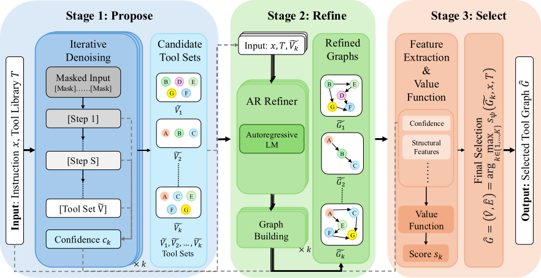

<div align="center">

# DiG-Plan

### Mitigating Early Commitment for Tool-Graph Planning via Diffusion Guidance

[](https://arxiv.org/abs/2606.05728)
[](https://2026.ijcai.org/)
[](LICENSE)
[](https://github.com/puddingyeah/DiG-Plan/actions/workflows/ci.yml)

Official implementation of the IJCAI-ECAI 2026 paper
**“DiG-Plan: Mitigating Early Commitment for Tool-Graph Planning via Diffusion Guidance.”**

</div>

DiG-Plan separates tool-graph planning into three stages: a diffusion language model proposes diverse tool sets, a shared autoregressive model refines each set into a dependency graph, and a lightweight value function selects a plan without an external LLM judge.



## News

- **2026-06-04:** Paper released on arXiv and accepted at IJCAI-ECAI 2026.
- **2026-08:** Code, paper splits, controlled-study scripts, and compact reproducibility artifacts prepared for public release.

## Main results

On the held-out TaskBench-23 compositional subset (`N=334`, `K=5`):

| Selector | ToolF1 ↑ | EdgeRec ↑ |
|---|---:|---:|
| K=1 | 0.685 | 0.244 |
| Heuristic | 0.690 | 0.311 |
| **Value function** | **0.716** | **0.309** |
| Oracle | 0.768 | 0.283 |

The released candidate pool and value function reproduce this table without downloading GPU models.

## Repository layout

```text
.
├── artifacts/
│   ├── candidate_pools/      # Compact paper-facing train/test candidate pools
│   ├── results/              # Reported TaskBench selection result
│   └── value_function/       # Released GradientBoostingRegressor bundle
├── assets/                   # Paper figures used by this README
├── data/
│   ├── ids_500.txt           # Historical filename; contains 501 balanced test IDs
│   ├── splits/               # TaskBench and API-Bank split IDs
│   └── taskbench/            # Paper-compatible flattened TaskBench source
├── docs/                     # Data, reproduction, and release-boundary notes
├── scripts/
│   ├── collect_candidate_data_v2.py          # Dream proposer + AR refiner
│   ├── collect_candidate_data_arproposer_v1.py
│   ├── collect_candidate_data_arbeam_v1.py
│   ├── collect_candidate_data_llada_v1.py
│   ├── collect_candidate_data_llada2_v1.py
│   ├── train_plan_scorer_v3.py
│   └── evaluate_selection_on_candidates.py
└── tests/
```

## Quick reproduction (CPU only)

This path checks the paper-facing value-function result using released artifacts. It does not load Dream or Qwen.

```bash
git clone https://github.com/puddingyeah/DiG-Plan.git
cd DiG-Plan

python -m venv .venv
source .venv/bin/activate
pip install -r requirements-analysis.txt

python scripts/evaluate_selection_on_candidates.py \
  --candidates_path artifacts/candidate_pools/taskbench_dream_k5_test334.json \
  --model_path artifacts/value_function/plan_scorer_combo07_toolset.pkl \
  --bootstrap 1000 \
  --seed 0 \
  --out_json results/taskbench_selection_eval.json
```

Expected rounded values are `0.685 / 0.244` for K=1, `0.690 / 0.311` for heuristic selection, `0.716 / 0.309` for the value function, and `0.768 / 0.283` for oracle selection.

> [!IMPORTANT]
> The value function is a Python pickle. Only load the copy obtained from this repository (or a file you trained yourself). Its runtime is pinned in `requirements-analysis.txt` because scikit-learn pickles are version-sensitive.

## Installation for model inference

The reference Dream environment uses Python 3.10 or 3.11, CUDA, and a GPU with at least 20 GB VRAM. A 24 GB GPU is recommended. Candidate collection is memory-efficient: the diffusion proposer and AR refiner are loaded in separate phases.

```bash
python -m venv .venv
source .venv/bin/activate
pip install -r requirements-inference.txt
```

The paper uses the following public models:

| Role | Model |
|---|---|
| Diffusion proposer | [`Dream-org/Dream-v0-Instruct-7B`](https://huggingface.co/Dream-org/Dream-v0-Instruct-7B) |
| AR refiner / AR baseline | [`Qwen/Qwen2.5-7B-Instruct`](https://huggingface.co/Qwen/Qwen2.5-7B-Instruct) |
| Alternative proposer | [`GSAI-ML/LLaDA-8B-Instruct`](https://huggingface.co/GSAI-ML/LLaDA-8B-Instruct) |
| Alternative proposer | [`inclusionAI/LLaDA2.0-mini-preview`](https://huggingface.co/inclusionAI/LLaDA2.0-mini-preview) |
| Retriever baseline | [`sentence-transformers/all-MiniLM-L6-v2`](https://huggingface.co/sentence-transformers/all-MiniLM-L6-v2) |

Model weights are intentionally not stored in this repository. Hugging Face IDs can be passed directly to the scripts, or replaced by local paths.

## Data

The paper evaluates on [TaskBench](https://github.com/microsoft/JARVIS/tree/main/taskbench) and [API-Bank](https://github.com/AlibabaResearch/DAMO-ConvAI/tree/main/api-bank). The compact TaskBench source and split IDs used by this release are included under `data/`; API-Bank data must be downloaded from its official release and converted locally.

See [docs/DATA.md](docs/DATA.md) for provenance, licenses, checksums, and conversion commands.

## Full TaskBench pipeline

Generate Dream proposals and refine them with Qwen:

```bash
python scripts/collect_candidate_data_v2.py \
  --dlm_path Dream-org/Dream-v0-Instruct-7B \
  --ar_path Qwen/Qwen2.5-7B-Instruct \
  --data_path data/taskbench/taskbench_hf_improved_flattened.jsonl \
  --ids_file data/ids_500.txt \
  --output_path results/taskbench_dream_k5.json \
  --device cuda:0 \
  --K 5 \
  --max_single 167 \
  --max_chain 167 \
  --max_dag 167 \
  --dlm_steps 128 \
  --seed 42
```

Train the judge-free value function on a disjoint candidate pool:

```bash
python scripts/train_plan_scorer_v3.py \
  --data_path artifacts/candidate_pools/taskbench_dream_k5_train670.json \
  --output_path results/plan_scorer_combo07_toolset.pkl \
  --model_type gbm \
  --feature_set toolset \
  --label combo \
  --combo_alpha 0.7 \
  --seed 42
```

Additional proposer and analysis commands are documented in [docs/REPRODUCIBILITY.md](docs/REPRODUCIBILITY.md).

## Controlled early-commitment study

The fixed-length 23-bit controlled study uses matched two-layer Transformer backbones for AR and masked denoising. The generator, trainers, and evaluator are included as `scripts/playground_toolset_*.py`. See [docs/REPRODUCIBILITY.md](docs/REPRODUCIBILITY.md) for the six-seed protocol reported in the paper.

## Verification

```bash
python -m pytest -q
python scripts/audit_public_release.py
```

The audit rejects private migration material, logs, queues, model-weight formats, absolute local paths, common secret patterns, unsafe symlinks, and unexpected large files. The exact release boundary is recorded in [docs/PUBLIC_RELEASE.md](docs/PUBLIC_RELEASE.md).

## Citation

```bibtex
@article{li2026digplan,
  title   = {DiG-Plan: Mitigating Early Commitment for Tool-Graph Planning via Diffusion Guidance},
  author  = {Li, Yansi and Zhang, Zhuosheng},
  journal = {arXiv preprint arXiv:2606.05728},
  year    = {2026},
  note    = {Accepted at IJCAI-ECAI 2026},
  url     = {https://arxiv.org/abs/2606.05728}
}
```

## License and attribution

DiG-Plan code is released under the [MIT License](LICENSE). TaskBench-derived data and metadata retain Microsoft/JARVIS attribution. API-Bank conversion support retains Alibaba DAMO-ConvAI attribution. See [THIRD_PARTY_NOTICES.md](THIRD_PARTY_NOTICES.md) and `licenses/`.
